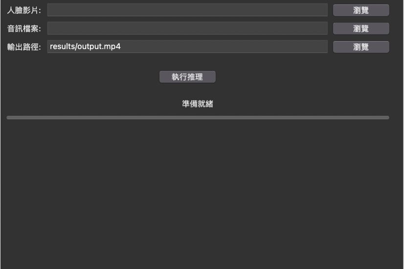

# Video Retake GUI

這是一個基於 Tkinter 的圖形化介面 (GUI)，用於執行 [video-retalking](https://github.com/OpenTalker/video-retalking) 的推理，讓使用者能夠輕鬆地將人臉影片與音訊合成。

## 功能特色
- 選擇人臉影片 (`.mp4`)
- 選擇音訊檔案 (`.wav`)
- 設定輸出影片位置
- 一鍵執行推理，並顯示處理狀態

## 安裝方式
### 1. 克隆專案
```bash
git clone https://github.com/你的帳號/video-retake.git
cd video-retake
```

### 2. 安裝必要套件
請確保已安裝 Python 3，然後使用 pip 安裝所需的依賴項：
```bash
pip install -r requirements.txt
```

## 使用方式
### 1. 啟動 GUI
```bash
python ui.py
```

### 2. 操作步驟
1. 點擊 `瀏覽` 按鈕選擇人臉影片 (`.mp4`)
2. 點擊 `瀏覽` 按鈕選擇音訊檔案 (`.wav`)
3. 設定輸出的影片路徑
4. 點擊 `執行推理` 開始處理
5. 等待結果，完成後會顯示輸出檔案位置

## 介面預覽


## 相關專案
- [video-retalking](https://github.com/OpenTalker/video-retalking)

聯絡我：rayc57429@gmail.com
